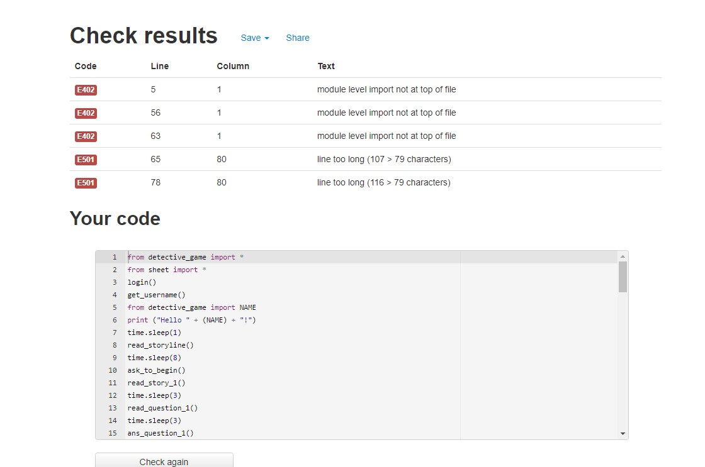

# Fugitive Hunt - Detective Game
(Developer: Liam Harrington)

[The live deployed app] (https://detective-game.herokuapp.com/)

## Contents
1. [Goals](#goals)
    1. [User Goals](#user-goals)
    2. [Developer Goals](#developer-goals)
2. [ Design](#design)
    1. [Flowchart](#flow-chart)
    2. [Data Models](#data-models)  
3.  [User Experience](#user-experience)
    1. [Target Audience](#target-audience)
    2. [User Stories](#user-stories)
4. [Technologies Used](#technologies-used)
    1. [Languages](#languages)
    2. [Frameworks and Tools](#frameworks-and-other-tools)
5. [Features](#features)
6. [Bugs](#Bugs)
7. [Testing](#validation)
    1. [Python Validation](#Python-validation)
    2. [Testing user stories](#testing-user-stories)

9. [Deployment](#deployment)
10. [Credits](#credits)

## Goals
- The goal of the app was to create a story-based game in which the user has to think about how they answer each question so as not to be arrested.
- The app was designed in a way that the user has to think about their answers and the resulting consequences.

### User Goals
- To be engaged in the story line
- To be made to think about their responses and the repercussions of them.

### Developer Goals
- Create an app that brings the user through a story
- Create an app that takes user input and changes the outcome based on it.
- Upload the results of each user's game to a spreadsheet.
- To have a username and password method of authentication.

## Design
### Flow Chart
The below flow chart shows the initial idea mapped out. This was created with [diagrams.net] (https://app.diagrams.net/)

### Data Models
- Lists : I used lists to creat the question functions. The questions were all placed in to a text file and then a list was created from this file to split each line in to a new entry on the list. I then used the indexing of this list to grab the questions in the question functions.
- Google Sheets / API - I used Google sheets API so that I can store usernames and passwords as well as document the results of each user's game in an external library.

### Libraries 
1. Time : I used this library to add a pause (sleep) for the user to read the options, questions, and story.
2. [Gspread] (https://docs.gspread.org/en/latest/) : I used Gspread to for the functions available for manipulating the google sheet and using the data already on the sheet.

## User Experience

### Target Audience
- People who enjoy text-based story games

### User Stories
### A first time user 
1. As a user I want to have to think about my actions when playing the game.
2. As a user I want my actions to have an impact on the output of the game.
3. As a user I want the game to have a story to keep me engaged.

### Developer Stories
1. As a developer I want to create an engaging story game.
2. As a developer I want the user to have to think about their responses to the detective.
3. As a developer I want to be able to document the outcome of each users' game.
4. As a developer I want an authentication method to allow entry to the game.

## Technologies Used
### Languages
- Python 3

### Frameworks and other tools
1. [Git](https://www.git-scm.com) Git was used as a means of version control within the GitPod terminal to push the code to GitHub.
2. [Github](https://www.github.com) GitHub was used to store the files in a repository and save changes pushed to it.
3. [Gitpod](https://www.Gitpod.io) Gitpod was used to write the code. Gitpod uses a ported version of Visual Studtio Code.
4. [Google Sheets and Google Cloud](https://cloud.google.com/cloud-console/) Google sheets were used to store data ie Username, password, end result. The cloud platform was used to manage credentials for access to the gooogle services.

## Features
### Login System
- Below is the login screen the user is presented with when they run the program.

- The usernames and passwords were stored on the google sheet and the login() funcion called these for authentication.

### Storyline
-There was a storyline featured throughout the program. This was stored in a folder named "story" and each txt file was called in a function to read the story to the user.

### Questions
- The user is asked a series of questions that they have to answer as presented by the detective. Each answer has an impact on the final verdict that the detective makes.

### Suspiscion Variable
- The suspiscion of the detective either remains the same or is raise/lowered depending on the users answers. This was stored as 'sus' in the detective_game.py file.
- If the user's suspiscion is below 3 they are free to go, if they are at 3 or above - they are brought in for further questioning.

### Google Sheet Data
- The final outcome of the game is sent to the google sheet.
- The name, outcome and suspiscion levels are all imported to the sheet.

     
- The code for this was heavily influenced by this document [WorthWebScraping](https://www.worthwebscraping.com/how-to-update-google-spreadsheet-using-python)
- The usernames and passwords were also stored on the google spreadsheet.

## Bugs
| **Bug** | **Fix** |
| ----------- | ----------- |
| Variables weren't updated at the end of the game, users were shown as free, 0 sus| Had to re-import the variables after the game completed for the loop. |
|  Initially tried a dictionary for the end result to import to sheet. This wouldn't upload in the desired format.| Used insert_row to just import the variables and defined the format. |
| Functions being called twice | Some test code in the detective_game file had remained, causing the run.py file to output some functions twice.|
| Variables weren't carrying over when changed with functions  | Had to re-import from other sheet after changes were made to the variables|

## Validation
### Python Validation
Python code was validated using [Pep8 Validation](http://www.pep8online.com).

run.py

- Line too long was an issue with validation but this was needed for the storyline to be printed to the game.
- Imports also weren't all at the top of the file, this was because after functions were run, some variables needed to be re-imported from the other programs.
- Details on this were listed in the bugs section.

detective_.py

- Line too long was an issue with validation but this was needed for the storyline to be printed to the game.

sheet.py

### User Stories
1. As a user I want to have to think about my actions when playing the game.
| **Feature** | **Action** | **Expected Result** | **Result** |
|Questions|The user is provided questions and the options to answer|based on input an answer is selected, changing the outcome of your game.|Working as expected|

2. As a user I want my actions to have an impact on the output of the game.
| **Feature** | **Action** | **Expected Result** | **Result** |
|Suspiscion Variable |Answer the detective's questions|Sus variable is impacted based on your answer |Working as expected|

3. As a user I want the game to have a story to keep me engaged.
| **Feature** | **Action** | **Expected Result** | **Result** |
|Sutoryline |Story is called from the story text files |A part of the story is read to the user |Working as expected|

### Developer Stories
1. As a developer I want to create an engaging story game.
| **Feature** | **Action** | **Expected Result** | **Result** |
|Sutoryline |Story is called from the story text files |A part of the story is read to the user |Working as expected|

2. As a developer I want the user to have to think about their responses to the detective.
| **Feature** | **Action** | **Expected Result** | **Result** |
|Questions|The user is provided questions and the options to answer|based on input an answer is selected, changing the outcome of your game.|Working as expected|

3. As a developer I want to be able to document the outcome of each users' game.
| **Feature** | **Action** | **Expected Result** | **Result** |
|Google Sheet |The user's results are sent to the spread sheet|The results of the game are displayed on the google sheet.|Working as expected|

4. As a developer I want an authentication method to allow entry to the game.
| **Feature** | **Action** | **Expected Result** | **Result** |
|Login System|The user is prompted to enter their user name and then password|The user can continue with correct credentials or is asked to enter again if incorrect. |Working as expected|

## Deployment
### Heroku
This program was deployed from GitHub using Heroku's platform.

For this process I had to:
- Create an account with Heroku
- Link my github repository with my Heroku app.
- Add the contents of my creds.json file to the config vars.
- Ensure that all files from the template provided by CodeInstitute were in place.
- I enabled automatic deployments as I had some code I wanted to test.

## Credits
- **Google** - for the gspread library, and the cloud platform's APIs.
- **Code Institute** For the template provided for deployment.
- **Varying Stack Overflow Posts** - For troubleshooting some of my issues with the program.
- **This specific Stack Overflow Post** - [StackOverFlow](https://stackoverflow.com/questions/3277503/how-to-read-a-file-line-by-line-into-a-list) for code to create a list from my questions.txt file.
- **WorthWebScraping** [WorthWebScraping](https://www.worthwebscraping.com/how-to-update-google-spreadsheet-using-python) - For some template code for importing my results to the google sheet.
